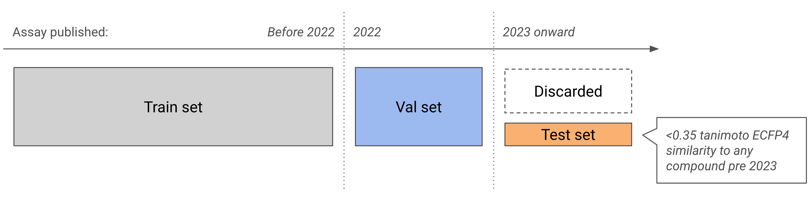

# Novelty-filtered Affinity Benchmark



**Paper**: [coming soon]() | **Dataset**: [coming soon]()

Code for generating a novelty-filtered and time-split benchmark for protein-ligand binding affinity prediction.

## Overview

The benchmark is constructed from ChEMBL binding affinity data using two complementary strategies to prevent data leakage:

1. **Time split**: activities are partitioned by assay publication year (train: before 2022, val: 2022, test: 2023+).
2. **Novelty filter**: test compounds are filtered by Tanimoto similarity (ECFP4 2048 fingerprints) — a compound is kept only if its maximum similarity to any earlier compound is below 0.35.

Val and test assays are further filtered to retain only well-characterised (assay, measurement-type) groups: minimum 10 unique compounds, pChEMBL SD ≥ 0.5, equality-relation measurements only, and at most one assay per publication.

The repo also contains code for a ligand-only baseline ML model, which can be used as a probe for what performance is possible to get with pure memorisation, for more information on how to use this read [docs/baseline.md](docs/baseline.md).

## Installation

### uv (recommended)

[uv](https://github.com/astral-sh/uv) is recommended. Requires Python 3.10+.

```bash
uv sync
source .venv/bin/activate
```

### conda

```bash
conda create -n nfab python=3.10
conda activate nfab
pip install -e .
```

## Reproducing the data

### Prerequisites: Set up ChEMBL

The benchmark is generated from a local ChEMBL PostgreSQL database. See [docs/chembl_setup.md](docs/chembl_setup.md) for instructions on setting up this database locally.

### 1. Configure the pipeline

Add your ChEMBL database credentials to `configs/benchmark.yaml`.

### 2. Run the pipeline

```bash
python -m nfab.run_pipeline --config configs/benchmark.yaml
```

The pipeline runs in 8 steps and writes intermediate files to `out/intermediate/` and final outputs to `out/`. The full ChEMBL 36 run takes approximately 45 minutes on a machine with 16 cores and requires ~40 GB of RAM.

## Output files

### `out/activities.parquet`

One row per activity measurement. Columns:

| Column | Description |
|---|---|
| `target_chembl_id` | ChEMBL target ID |
| `assay_chembl_id` | ChEMBL assay ID |
| `ligand_chembl_id` | ChEMBL compound ID |
| `standard_type` | Measurement type: `Ki`, `Kd`, or `IC50` |
| `pchembl_relation` | Inequality relation on the pChEMBL scale (e.g. `<`, `=`). Inverted from `standard_relation` because −log10 reverses inequality direction. |
| `pchembl_value_filled` | pChEMBL value (−log10 scale). Uses ChEMBL's `pchembl_value` where available; otherwise computed. |
| `split` | Split label (see below) |
| `mw_freebase` | Molecular weight of the parent compound (salt-stripped), from ChEMBL `compound_properties` |
| `data_validity_comment` | ChEMBL data validity flag (`NULL` or `Manually validated`) |
| `potential_duplicate` | ChEMBL duplicate flag |
| `doc_year` | Publication year of the assay document |
| `cpd_earliest_year` | Earliest publication year for the compound across all ChEMBL records |
| `max_sim_pre_2023` | Max Tanimoto similarity (ECFP4) to any compound with `cpd_earliest_year < 2023` (test novelty cutoff) |
| `most_sim_cpd_pre_2023` | ChEMBL ID of the most similar pre-2023 compound |
| `max_sim_pre_2022` | Max Tanimoto similarity (ECFP4) to any compound with `cpd_earliest_year < 2022` (val novelty cutoff) |
| `most_sim_cpd_pre_2022` | ChEMBL ID of the most similar pre-2022 compound |
| `canonical_smiles` | Canonical SMILES from ChEMBL `compound_structures` |

#### Split labels

| Label | Condition |
|---|---|
| `train` | `doc_year < 2022` |
| `val_novel` | `doc_year == 2022` and compound is novel vs. pre-2022 compounds |
| `val_not_novel` | `doc_year == 2022` and compound is not novel vs. pre-2022 compounds |
| `test` | `doc_year >= 2023` and compound is novel vs. pre-2023 compounds |
| `discard_not_novel` | `doc_year >= 2023` and compound is not novel (excluded by default) |

A compound is **novel** if its maximum ECFP4 Tanimoto similarity (ECFP4 2048 fingerprint) to all earlier compounds is strictly below `tanimoto_threshold` (default 0.35). Rows with no `doc_year` are excluded from all splits.

### `out/targets.parquet`

One row per single-protein target. Columns: `target_chembl_id`, `uniprot_id`, `gene_name`, `target_class`, `target_family`, `organism`, `target_name`, `sequence`.

### `out/intermediate/`

Intermediate files written between steps for inspection and debugging:

| File | Contents |
|---|---|
| `activities_raw.parquet` | Raw activity query results from ChEMBL |
| `compounds_raw.parquet` | Compounds (SMILES, earliest year, MW) filtered to the active activities |
| `targets_raw.parquet` | Single-protein targets with sequence and classification |
| `assay_docs.parquet` | Document metadata per assay: `assay_chembl_id`, `doc_chembl_id`, `doi`, `title`, `src_description` |
| `fingerprints.npz` | ECFP4 fingerprint matrix (`fps`) and compound IDs (`names`) |
| `compounds_with_novelty.parquet` | Compounds enriched with novelty columns for both the 2022 and 2023 cutoffs |
| `split_assignments.parquet` | Activities with split labels before final column selection and filtering |

## Data inclusion criteria

The following filters are applied when querying ChEMBL:

| Criterion | Value | Rationale |
|---|---|---|
| Target type | `SINGLE PROTEIN` only | Excludes protein complexes, cell lines, organisms, etc. |
| Assay type | `B` (binding) only | Excludes functional, ADMET, and other non-binding assays |
| Confidence score | `9` (maximum) | Direct single-protein target assignment; excludes lower-confidence mappings |
| Relationship type | `D` or `H` | Direct or homologous target mappings; excludes non-specific and unknown relationships |
| Measurement type | `Ki`, `Kd`, or `IC50` | Standard binding affinity readouts |
| Data validity | `NULL` or `Manually validated` | Excludes flagged/unreliable entries |
| Protein sequence | Wildtype only | Excludes assays against mutant sequences (annotated in `variant_sequences`) |

After ChEMBL retrieval, three further filters determine which rows appear in the final output:

- **No `doc_year`**: rows with a missing publication year cannot be assigned to a split and are excluded.
- **Novelty (test/val only)**: by default, test-year compounds that are not novel vs. pre-2023 compounds (`discard_not_novel`) are excluded. This can be changed via `keep_discard_not_novel` in the config.
- **Assay quality (test/val only)**: (assay, measurement-type) groups are removed if they have fewer than 10 unique compounds, a pChEMBL SD below 0.5, non-equality relations, or share a publication with another passing assay. Configurable via `filter_val_and_test_sets` in the config.

## Citation

If you use NFAB in your research, please cite:

```bibtex
@article{mattsson2026critical,
  title   = {Critical Assessment of Binding Affinity Benchmarks: Data Leakage and the Illusion of Generalization},
  author  = {Mattsson, Bj{\"o}rn and Walters, W. Patrick},
  year = {2026},
  doi = {},
  journal = {},
}
```

## Running tests

```bash
uv sync --extra dev
uv run pytest
```

## Linting

This project uses [ruff](https://github.com/astral-sh/ruff) for linting and formatting:

```bash
uv run ruff check src/ tests/
uv run ruff format src/ tests/
```
